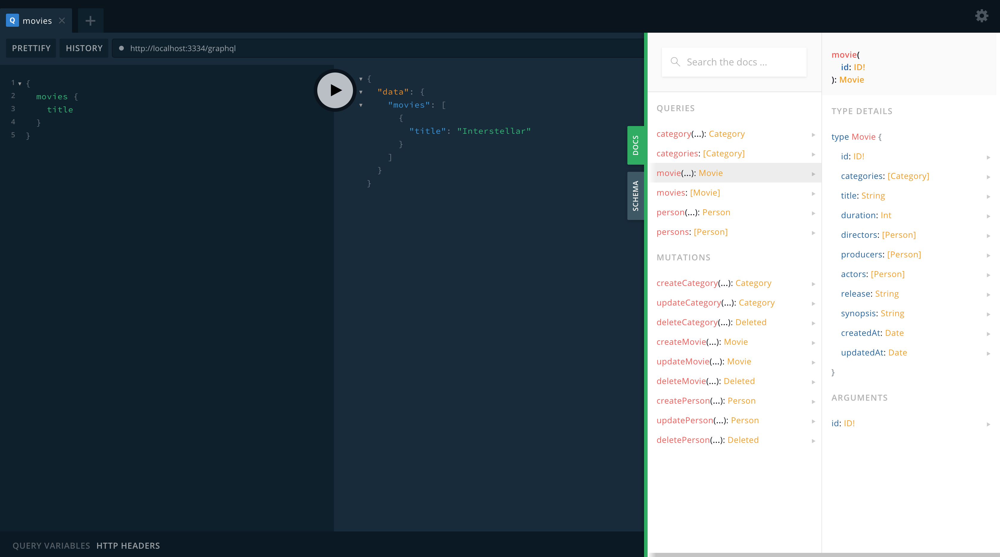

# F02

> F01 Service

## Setup

```console
npm start d02
npm start f02
```

## Documentation

This project is using GraphQL which generate his own documentation available directly in the [GraphQL Playground](http://localhost:3334/graphql) under the `docs` tab.



## Request Testing

An insomnia configuration is included in order to test the requests available.
